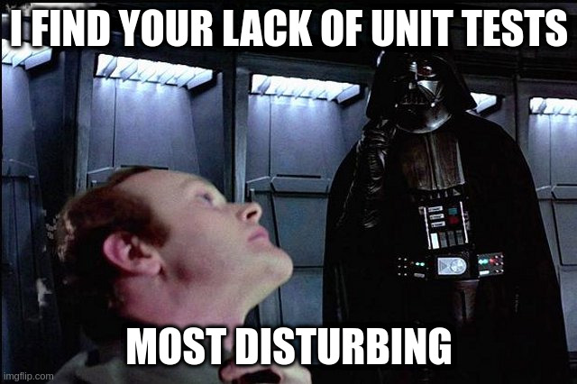

# Professional Python Course - Deathstar Example

This repository is part of the Tea'n Tech [Professional Python Course][course].
The content of this repo represents the deathstar code example which is used
for explanations throughout the learning material.
May the force be with you!

[course]: https://github.com/Tea-n-Tech/professional-python
